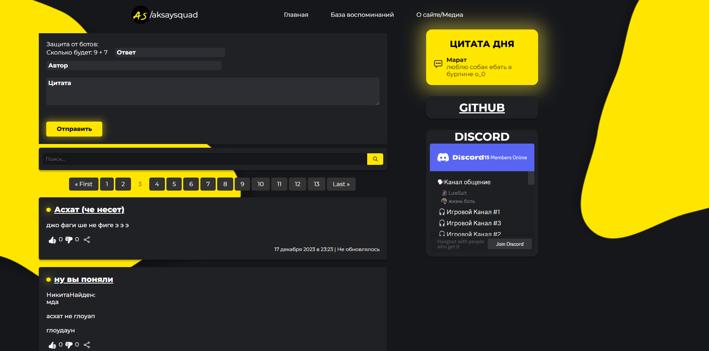
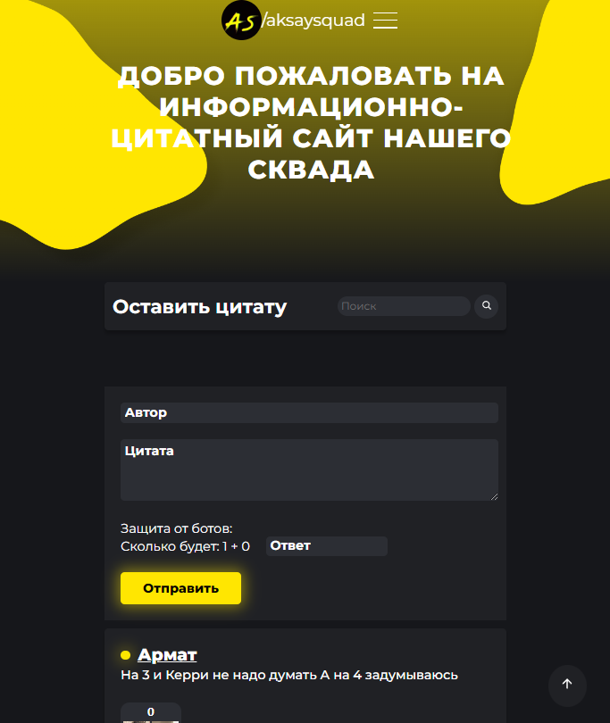

# Aksay-Squad-v2
<h1>Better, Faster, Userfriendly, more beautiful<3</h1>

### Last updates: 
 22.05.23 /2
 
 Added Discord Webhook to our server
  
22.05.23

Release on [infinityfreeapp.com](https://aksaysquad.infinityfreeapp.com/)
  
14.05.23
  
Adaptive layout
  
21.04.23
  
Liking system, some upgrades, css features, demo memes section, database update

### I'm currenlty working on optimizing and fixing bugs on release

 
### 💩unnecessary links
  

 
### webdev contact
[damirtag](https://t.me/damirtag).

 ## 💯Future updates
- [x] Liking System
- [ ] Light theme
- [ ] Login System
- [ ] Create simple forum
